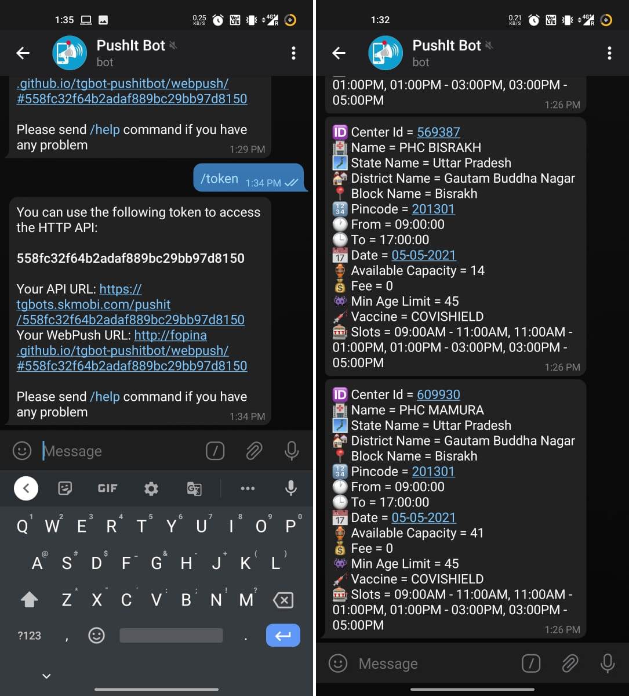

### Vaccine Availability Alerts

 Program `main.py` checks the cowin portal periodically to find vaccination slots available in your pin code and for your age. If found, it will send you push notifications on telegram every minute until the slots are available.

**Steps to run the script**:

1. Open telegram app and search for @PushitBot
2. Generate pushitbot token by sending `/token` to the bot.
3. Enter the details in the `.env` file
4. Install dependencies `pip install -r requirements.txt`
5. Run the application `python main.py`

**Configuring .env file**
````
PINCODES=201301, 121003, 500081
MIN_AGE_LIMIT=53
TOKEN=<your-token>
INTERVAL=60
````

**Illustration**


